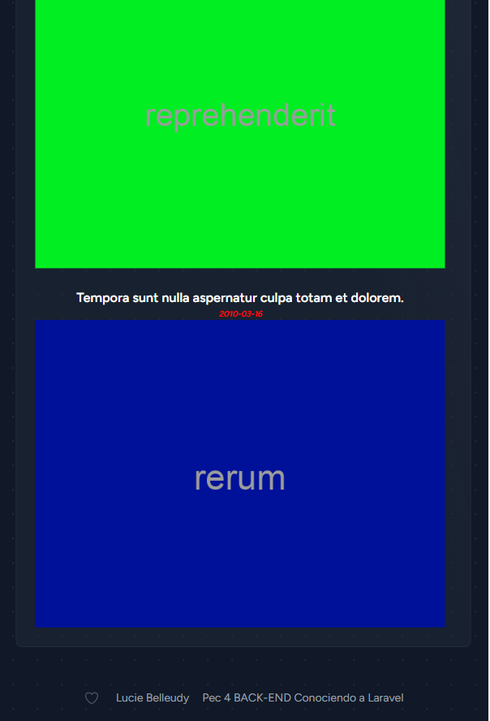
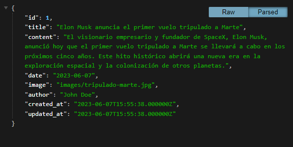
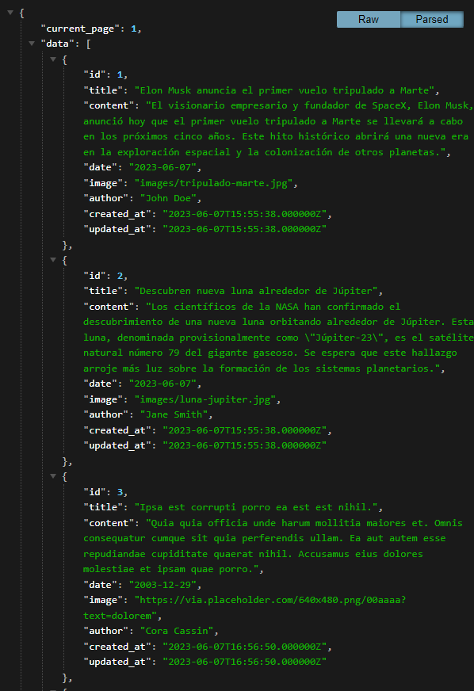
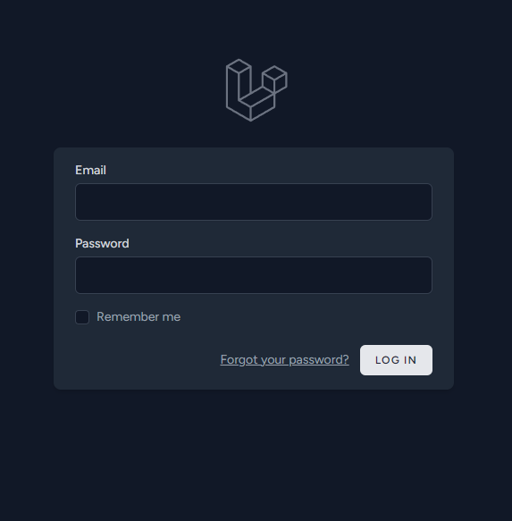
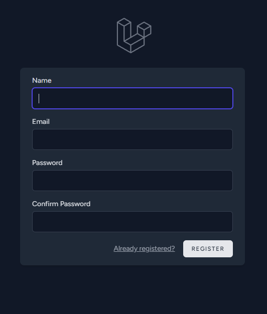
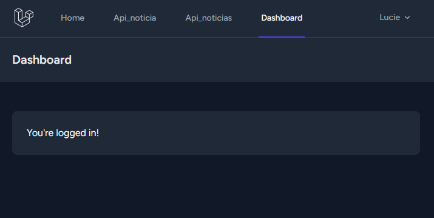
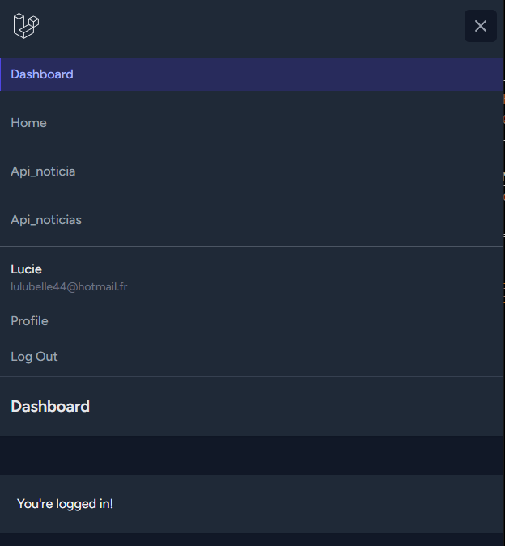

<h1 style="color:red; font-weight:bold; background-color:white; text-align:center; font-size:40px; padding:20px; border-radius:20px; box-shadow:5px 5px 20px white; border:none">Proyecto web realizado con Laravel en Local.</h1>

Se trata de un sitio ficticio de noticias.

Se han mantenido los estilos predeterminado de Laravel, que se basan en Atomic CSS

Dispone de un menú de navegación con los items de Home, API_Noticia, API_Noticias, Login y Register cuando el usuario no esta conectado.
El menú da la opción de Dashboard cuando el usuario esta conectado.

El proyecto està conectado con una base de datos en MySQL, Phpmyadmin.

El proyecto es Responsive y se adapta al tamaño de pantallas de diferentes dispositivos.

## LANZAR PROYECTO EN EL NAVEGADOR:
- será necesario disponer de una base de datos creada
- será necesario lanzar MySQL en Xampp (por ejemplo)
- será necesario levantar el servidor mediante el comando `php artisan serve`

## Paginá Home:
- muestra un listado de 5 noticias
- 2 de ellas son "reales" y se han hecho mediante Tinker
- 3 de ellas son "ficticias" y se han realizado mediante Factory, Faker y Seeder
- al clickar en el titulo de cada noticia, se acceder a la página única de cada noticia

## Pagina Api_Noticia:
- devuelve en formato JSON la noticia identificada con un id
- se puede probar su funcionamiento en Postman

## Pagina Api_Noticias:
- devuelve en formato JSON la primera pagina de las noticias
- se puede probar su funcionamiento en Postman

## Pagina Login:
- opcion de menú creada con Breeze
- permite acceder al formulario de autentificación
- opcion disponible solo cuando el usuario no esta conectado

## Pagina Register:
- opción de menú creada con Breeze
- permite acceder al formulario de registro
- opción disponible solo cuando el usuario no está conectado

## Pagina Dashbord:
- opción de menú creada con Breeze
- permite ver el mensaje por defecto de Laravel "You're logged in!"
- permite acceder a las opciones Profile y Logout
- opción disponible solo cuando el usuario está conectado

## Pagina Profile:
- opción de menú creada con Breeze
- permite acceder al perfil del usuario
- opción disponible solo cuando el usuario está conectado
- dispone de la opcion Logout para cerrar la sesion

 

<h2 style="text-align:center; font-size:30px; font-weight:bold; background-color:red;padding:20px">PROYECTO EN FOTOS</h2>
<h3 style="text-align:center">HOME PAGE</h3>

<h3 style="text-align:center">APIs</h3>

<h3 style="text-align:center">LOGIN</h3>

<h3 style="text-align:center">REGISTER</h3>

<h3 style="text-align:center">DASHBOARD</h3>

 

<h1 style="color:red; font-weight:bold; background-color:white; text-align:center; font-size:40px; padding:20px; border-radius:20px; box-shadow:5px 5px 20px white; border:none">Projet web réalisé avec Laravel en Local.</h1>

Il s'agit d'un site fictif d'articles d'informations.

Les styles par défault de Laravel, basés sur Atomic CSS, ont été conservés.

Le project dispose d'un menu de navegation avec les éléments Home, API_Noticia, API_Noticias, Login et Register lorque que l'utilisateur n'est pas connecté. Le menu propose l'option Dashboard quand l'utilisateur est connecté

Le projetc est relié à une base de donnés sur MySQL et Phpmyadmin.

Le project est Responsive et s'adapte à la taille des écrans de différents dispositifs.

## LANCER LE PROJECT DANS LE NAVIGATEUR:
- il sera nécessaire de disposer d'une base de données créé
- il sera nécessaire de lancer MySQL sur Xampp (par exemple)
- il sera nécessaire de lancer le serveur avec la commande `php artisan serve`

## Page Home:
- montre une liste de 5 articles d'information
- 2 d'entre elles sont "réelles" et elles ont éte crées avec Tinker
- 3 d'entre elles sont "fictives" et elles ont été crées avec Factory, Faker et Seeder
- en cliquant sur le titre de chaque article, on accède à la page unique de chaque article d'information

## Page Api_Noticia:
- renvoie au format JSON l'article identifié par un id
- il est possible de tester son fonctionnement avec Postman

## Page Api_Noticias:
- renvoie au format JSON la première page des articles d'information
- il est possible de tester son fonctionnement avec Postman

## Page Login:
- option de menu crée avec Breeze
- permet acceder au formulaire d'autentification
- option disponible seulement si l'utilisateur n'est pas connecté

## Page Register:
- option de menu crée avec Breeze
- permet acceder au formulaire d'inscription
- option disponible seulement si l'utilisateur n'est pas inscrit

## Page Dashbord:
- option de menu crée avec Breeze
- permet voir le message par défault de Laravel "You're logged in!"
- permet accéder aux options Profile et Logout
- option disponible seulement quand l'utilisateur est connecté

## Page Profile:
- option de menu crée avec Breeze
- permet accéder au profil de l'utilisateur
- option disponible seulement quand l'utilisateur est connecté
- dispose de l'option Logout pour fermer la sesion

 

<h2 style="text-align:center; font-size:30px; font-weight:bold; background-color:red;padding:20px">PROJET EN PHOTOS</h2>
<h3 style="text-align:center">HOME PAGE</h3>

<h3 style="text-align:center">APIs</h3>

<h3 style="text-align:center">LOGIN</h3>

<h3 style="text-align:center">REGISTER</h3>

<h3 style="text-align:center">DASHBOARD</h3>

 
